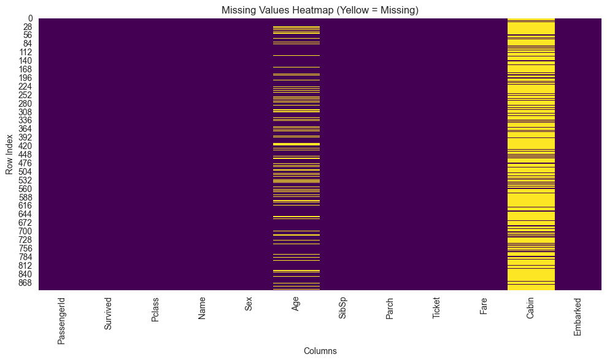
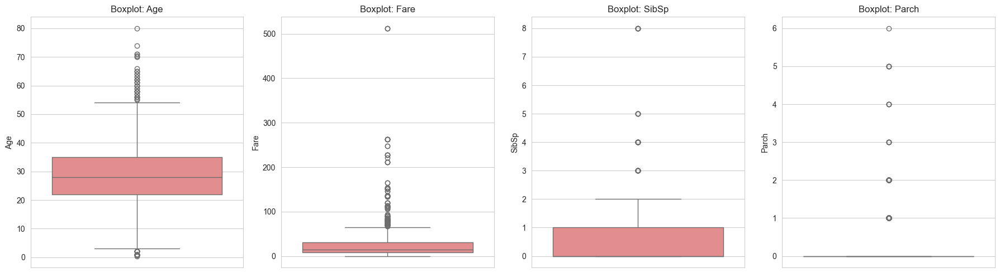
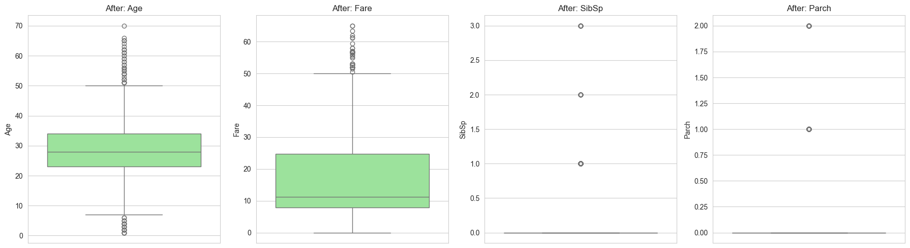
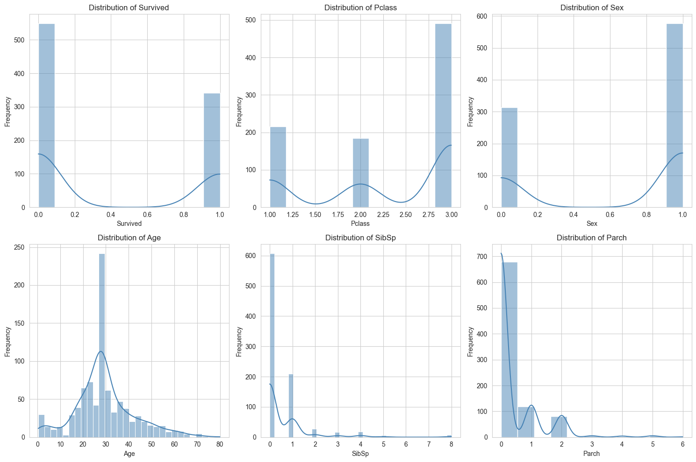

<div align="center">

# 🧹 Task 1: Data Cleaning & Preprocessing
### AI & ML Internship — Elevate Labs

*End-to-end preprocessing of the Titanic dataset — missing values, encoding, outliers, and scaling — with every decision explained.*


</div>

---

## 📌 Objective

Perform end-to-end data cleaning and preprocessing on the **Titanic dataset** to prepare it for machine learning. Every preprocessing decision — from imputation strategy to scaling method — is documented with reasoning, making this notebook suitable both for direct execution and for interview discussion.

## 📂 Dataset

| | |
|---|---|
| **Source** | [Titanic – Machine Learning from Disaster (Kaggle)](https://www.kaggle.com/c/titanic/data) |
| **Local file** | `dataset/titanic.csv` |
| **Shape** | 891 rows × 12 columns |

<details>
<summary><strong>Column reference</strong></summary>

| Column | Type | Description |
|--------|------|-------------|
| PassengerId | int | Unique passenger identifier |
| Survived | int | Target variable (0 = No, 1 = Yes) |
| Pclass | int | Ticket class (1 = 1st, 2 = 2nd, 3 = 3rd) |
| Name | str | Passenger full name |
| Sex | str | Gender |
| Age | float | Age in years |
| SibSp | int | Siblings / spouses aboard |
| Parch | int | Parents / children aboard |
| Ticket | str | Ticket number |
| Fare | float | Passenger fare |
| Cabin | str | Cabin number |
| Embarked | str | Port of embarkation (C, Q, S) |

</details>

## 🛠️ Technologies

`Python 3.x` · `Pandas` · `NumPy` · `Matplotlib` · `Seaborn` · `Scikit-learn` · `Jupyter Notebook`

## 📁 Project Structure

```
task-1-data-preprocessing/
├── dataset/
│   ├── titanic.csv              # Raw dataset
│   └── titanic_cleaned.csv      # Preprocessed output
├── notebooks/
│   └── data_preprocessing.ipynb # Main notebook (20 sections)
├── screenshots/                 # Visualizations used in this README
├── README.md
├── requirements.txt
└── .gitignore
```

---

## 🔍 Preprocessing Steps

### 1. Initial Data Exploration
- Loaded the dataset and verified its shape (891 × 12)
- Inspected column names, data types, and summary statistics
- Identified missing values and data quality issues

### 2. Missing Value Strategy

<p align="center">
  
  <br>
  <sub><i>Yellow = missing. <code>Age</code> and <code>Cabin</code> show clear gaps; <code>Embarked</code> is nearly complete.</i></sub>
</p>

| Column | Missing % | Action | Reasoning |
|--------|-----------|--------|-----------|
| Cabin | ~77% | Dropped | Too sparse for reliable imputation |
| Age | ~20% | Median imputation | Right-skewed; median is robust to outliers |
| Embarked | ~0.2% | Mode imputation | Only 2 missing; categorical mode is standard |
| Fare | 0% | No action | Complete |

### 3. Duplicate Detection
- Checked for duplicate rows using `df.duplicated()`
- No duplicates found in the Titanic dataset

### 4. Encoding Strategy

| Column | Technique | Reasoning |
|--------|-----------|-----------|
| Sex | Label Encoding | Binary nominal; compact 0/1 representation |
| Embarked | One-Hot Encoding | Nominal with no inherent order; avoids false ordinal assumptions |
| Name, Ticket, PassengerId | Dropped | High cardinality / unique identifiers; not predictive features |

### 5. Outlier Strategy

<p align="center">
  
  <br>
  <sub><i>Before: Age, Fare, SibSp, and Parch all show extreme values beyond the IQR whiskers.</i></sub>
</p>

<p align="center">
  
  <br>
  <sub><i>After: distributions are tighter once IQR-based bounds are applied.</i></sub>
</p>

- **Detection method:** IQR (Interquartile Range)
- **Columns checked:** Age, Fare, SibSp, Parch
- **Action:** Removed rows with extreme values in Fare (> upper bound), SibSp (> 3), Parch (> 2), and Age (outside 1–70)
- **Result:** Dataset reduced from 891 to ~730 rows (~18% removed)

### 6. Scaling Strategy
- **Technique:** Standardization (`StandardScaler`)
- **Reasoning:** Preserves distribution shape, robust to outliers, preferred for most ML algorithms (SVM, KNN, Logistic Regression)
- **Leakage prevention:** Correct train/test split approach — fit the scaler only on training data, then transform test data separately

### Distributions at a Glance

<p align="center">
  
  <br>
  <sub><i>Distribution of Survived, Pclass, Sex, Age, SibSp, Parch, and Fare.</i></sub>
</p>

---

## 📊 Results

| Metric | Raw | After Preprocessing |
|--------|-----|---------------------|
| Rows | 891 | ~730 |
| Columns | 12 | 10 (after dropping Cabin, Name, Ticket, PassengerId; adding 2 dummy cols) |
| Missing Values | 867 | 0 |
| Duplicate Rows | 0 | 0 |
| Scaled Features | No | Yes (Age, Fare, SibSp, Parch) |

**Output file:** `dataset/titanic_cleaned.csv`

## 🚀 How to Run

1. Clone the repository
   ```bash
   git clone https://github.com/Ash-Misty/ElevateLabs_intern.git
   cd ElevateLabs_intern/task-1-data-preprocessing
   ```
2. Install dependencies
   ```bash
   pip install -r requirements.txt
   ```
3. Launch Jupyter
   ```bash
   jupyter notebook
   ```
4. Open `notebooks/data_preprocessing.ipynb` and run all cells sequentially

## 💡 Key Learnings

- Missing value imputation must match the data distribution (median for skewed, mode for categorical)
- One-hot encoding is safer for nominal variables; label encoding can mislead models if no order exists
- IQR is preferred over z-score for outlier detection in skewed data
- `StandardScaler` is generally better than `MinMaxScaler` for ML preprocessing
- Data leakage is subtle but critical — always fit transformers on training data only
- Always perform a final quality check before saving cleaned data

## 🎯 Interview Preparation

The notebook includes detailed Q&A for 8 common interview questions:

1. Types of missing data (MCAR, MAR, MNAR)
2. Handling categorical variables
3. Normalization vs. standardization
4. Detecting outliers
5. Importance of preprocessing
6. One-hot vs. label encoding
7. Handling data imbalance
8. Can preprocessing affect model accuracy?

Each answer includes a simple explanation, technical details, a concrete example, and a possible follow-up question.

---

<div align="center">
<sub>Part of the <a href="https://github.com/Ash-Misty/ElevateLabs_intern">Elevate Labs AI & ML Internship</a> task series.</sub>
</div>
